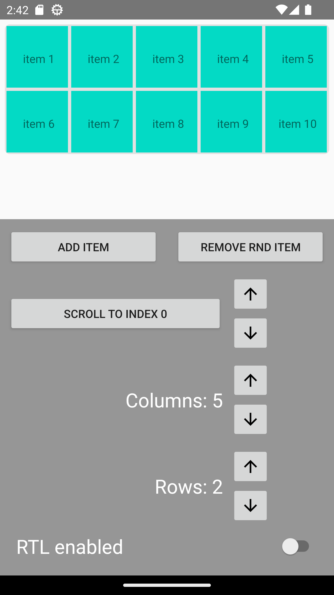

# What it does

This application is an example application presenting `CustomLayoutManager` and `CustomSnapHelper` capabilities.
It was built on basic AndroidStudio's "EmptyActivity" template.

`CustomLayoutManager` can place items in a specific order for provided number of rows and columns.
RecyclerView scales size automatically based on rows and column values, item size is set to be (recyclerWidth / columns).
`CustomSnapHelper` snaps to whole pages (a page is rows * column), not individual items.

Drag and drop functionality has only been implemented inside one RecyclerView with `ItemTouchHelper` library. Drag and drop between two recyclers 
is definitely doable, but after gathering enough information on potential solutions it became apparent that for it to work in a sensible, 
predictable and usable way it would take too much time to make it work - hence no support for it in the current version.

# Architecture

Application has been kept as simple as possible; no databinding, no fancy views and widgets or other kind of helpers that would usually be present
in an application. The only "nice to have" library is LiveData, which is used to update items list and notify MainActivity that adapter settings have changed.
Line break has been set to 160 characters.

# Installation

- Download Android Studio (developed on Android Studio Iguana | 2023.2.1 Patch 1)
- Select build variant
- Build project and run

# Video presentation

https://github.com/user-attachments/assets/56323163-c5a1-4eb4-97f2-05ddfdcbc28c

# License
    Copyright 2024 Wojciech Latala

    Licensed under the Apache License, Version 2.0 (the "License");
    you may not use this file except in compliance with the License.
    You may obtain a copy of the License at

       http://www.apache.org/licenses/LICENSE-2.0

    Unless required by applicable law or agreed to in writing, software
    distributed under the License is distributed on an "AS IS" BASIS,
    WITHOUT WARRANTIES OR CONDITIONS OF ANY KIND, either express or implied.
    See the License for the specific language governing permissions and
    limitations under the License.
